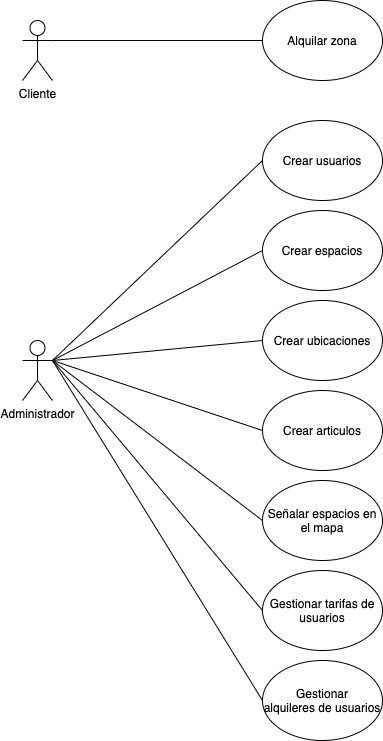

# Casos de Uso

En el diagrama observamos nuestras dos entidades principales: Clientes y 
Administradores.

Es importante aclarar a que nos referimos cuando hablamos de que un 
administrador creará a los usuarios. La aplicación no contará con registro
de usuarios, se solicitará el alta en la plataforma a la organización encargada
del sistema.

